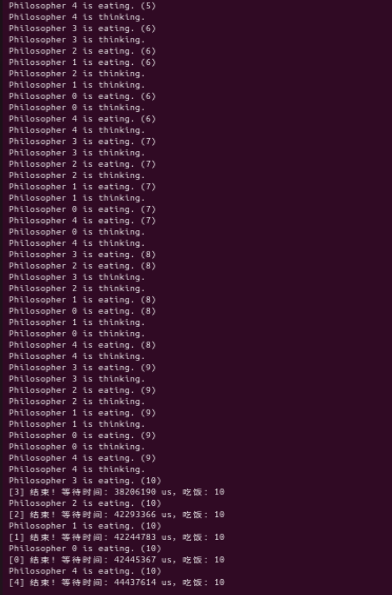
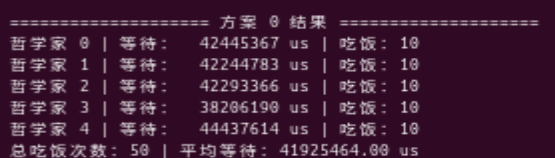
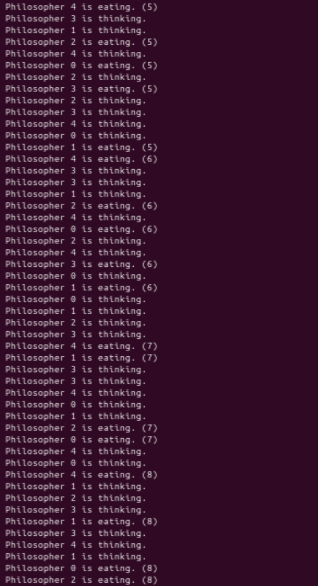
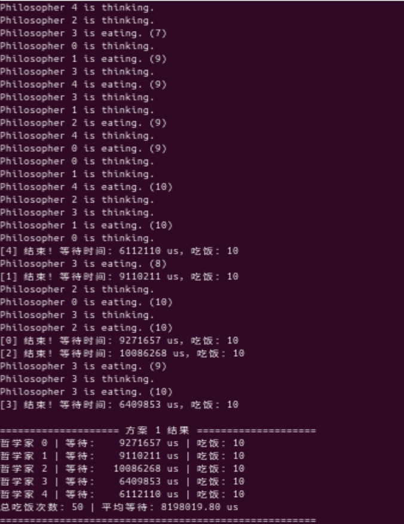
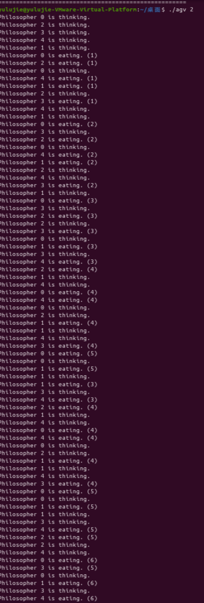
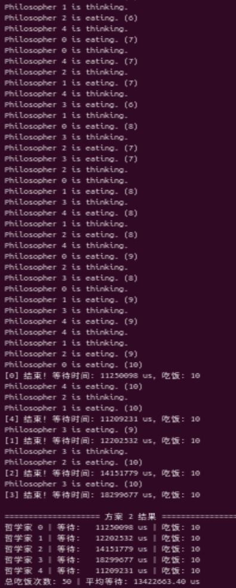
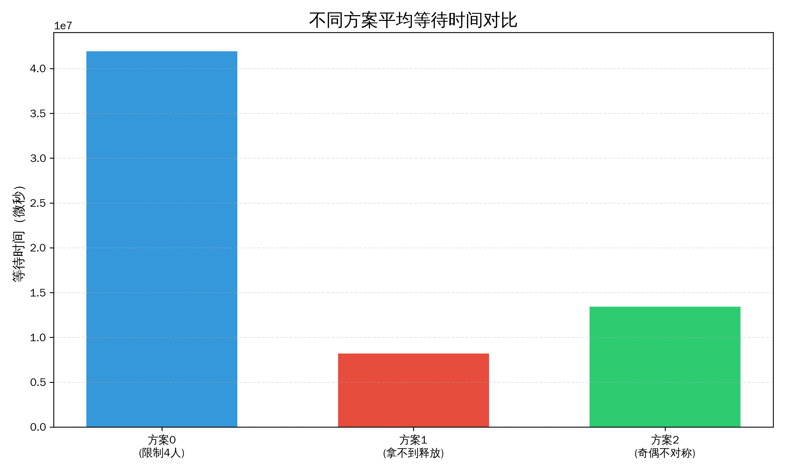
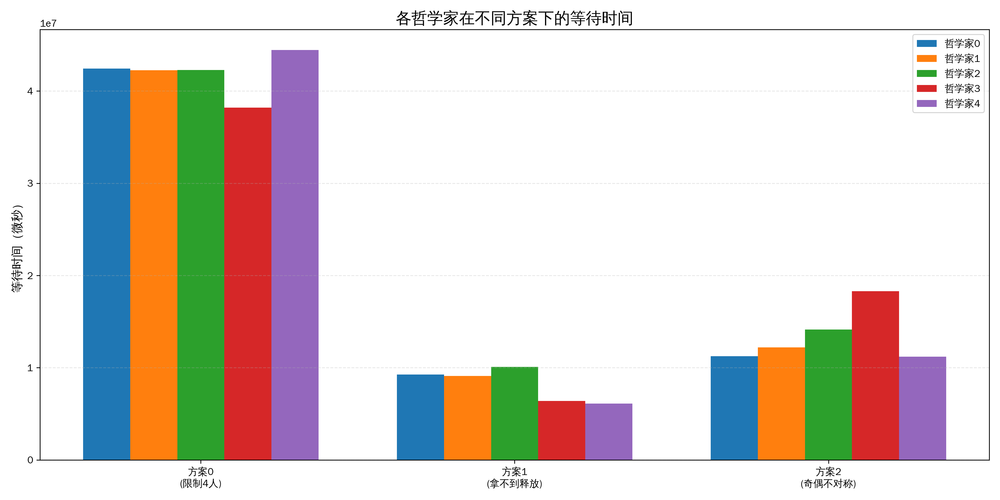
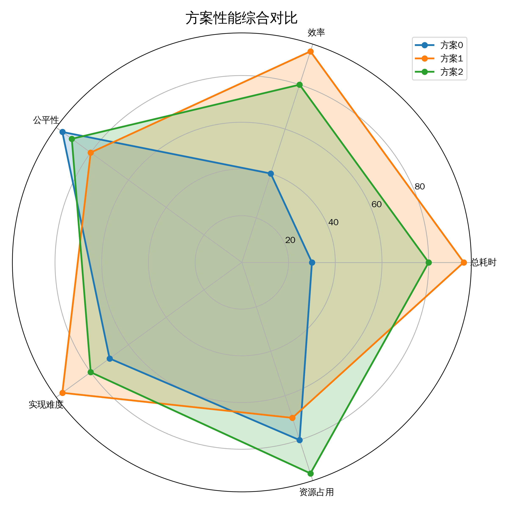

# 多AGV小车共享充电桩资源问题（哲学家就餐问题模拟）


本项目是**操作系统原理**课程中经典进程同步问题（哲学家就餐问题）的实际场景应用模拟。项目将经典的哲学家就餐问题包装为自动化仓储物流系统中的“**多AGV小车共享充电桩资源问题**”。

## 📌 项目背景

在自动化仓储物流系统中，多台 AGV（自动导引车）小车需要共享有限的充电桩资源。设定每个 AGV 充电时必须同时占用两个相邻的充电桩（类比哲学家的两根筷子）。当多台 AGV 同时请求充电时，极易发生资源竞争甚至死锁现象。

本系统在 Linux 平台下使用 C 语言的 POSIX 线程库（`pthread`）进行实时调度模拟，旨在解决以下核心问题：
1. **避免死锁**：确保系统不会陷入相互等待的僵局。
2. **提高资源利用率**：让充电桩发挥最大效能。
3. **最小化等待时间**：减少 AGV 排队等待充电的时间。

---

## 🚀 核心防死锁方案

本项目实现了三种不同的死锁规避策略，可以通过运行参数快速切换测试：

### 方案 0：限制并发数方案 (Limit Dining Room)
- **原理**：打破死锁的“循环等待”条件。通过全局信号量（Semaphore）限制同时尝试拿取充电桩的 AGV 数量最多为 4 台（`NUM-1`）。
- **特点**：保证系统中至少有 1 台 AGV 可以成功拿到左右两个充电桩完成充电，彻底避免 5 台 AGV 同时申请资源形成的死锁闭环。公平性极好，但并发效率受限。

### 方案 1：拿取失败即释放方案 (Try-Lock)
- **原理**：打破死锁的“请求与保持”条件。使用非阻塞加锁函数 `pthread_mutex_trylock`，AGV 先获取左侧充电桩，再尝试获取右侧；若右侧获取失败，则立即释放已占用的左侧充电桩并重新排队。
- **特点**：从根源上消除“持有一个资源、等待另一个资源”的情况。响应速度极快，系统总耗时最短，但可能会导致个别 AGV 资源分配不均。

### 方案 2：奇偶非对称拿取方案 (Asymmetric)
- **原理**：打破死锁的“循环等待”条件。偶数编号的 AGV 先拿右侧充电桩再拿左侧，奇数编号的 AGV 先拿左侧再拿右侧。
- **特点**：避免了所有 AGV 按同一顺序申请资源形成的等待链。综合性能最平衡，在保证较高公平性与效率的同时实现了最优的资源利用率。

---

## 🛠️ 编译与运行指南

### 1. 环境依赖
- Linux 操作系统
- GCC 编译器
- POSIX 线程库 (`pthread`)

### 2. 编译项目
在项目根目录下，进入 `src` 文件夹并执行编译命令：

```bash
cd src
gcc -o agv_charging agv_charging.c -lpthread
```

### 3. 运行模拟
编译成功后，通过传入不同的参数（0, 1, 2）来选择运行对应的防死锁方案：

```bash
# 运行方案 0（限制并发数）
./agv_charging 0

# 运行方案 1（拿取失败即释放）
./agv_charging 1

# 运行方案 2（奇偶非对称拿取）
./agv_charging 2
```

---

## 📊 性能数据与图表分析

团队使用 Python 对三种方案的运行数据进行了收集和可视化分析。所有方案均成功实现了 100% 死锁规避，且每台 AGV 均完成了 10 次完整的充电循环。

### 运行过程截图
下面是三种方案的终端运行日志与最终数据汇总截图：

#### 方案 0：限制并发数方案
<p align="center">
<br>
<br>

</p>

#### 方案 1：拿取失败即释放方案
<p align="center">
<br>
<br>

</p>

#### 方案 2：奇偶非对称拿取方案
<p align="center">
<br>

</p>

### 性能对比图表

**1. 平均等待时间对比**
方案 1 的平均等待时间最短，响应效率表现最优；方案 0 的并发限制导致整体等待时间显著增加。



**2. 各 AGV 小车等待时间分布**
反映了调度算法的公平性。方案 0 分布最均匀，公平性最好；方案 2 存在一定的调度不均；方案 1 的分布均匀性居中。



**3. 性能综合雷达图**
从总耗时、效率、公平性、实现难度、资源占用 5 个维度对 3 种方案进行了综合评估：
- **方案 0**：公平性最优，系统最稳定。
- **方案 1**：总耗时与效率表现最优，响应极快。
- **方案 2**：综合性能最平衡，无明显短板。



*(图表生成脚本详见 `scripts/analysis.py`)*

---

## 🧠 科技伦理思考 (人本主义算法设计)

在算法设计中，脱离实际场景的纯性能最优解往往是有局限性的。资源调度算法必须兼顾**分配公平**，不能让技术加剧资源分配的失衡（例如为了整体吞吐量而让某一台 AGV 陷入“饥饿”状态）。

技术的落脚点永远是人，算法需保证**可解释性**，人类必须始终握有对系统的最高控制权。同时，技术设计需优先守住**安全底线**，在预判风险、做好兜底（如 100% 避免死锁）的前提下，再去追求性能的极致优化。

---

## 👥 团队成员 (第五组)

- 林宇轩
- 刘剑豪
- 余露洁
- 张楠

*完整的实验报告文档详见 `docs/1-线程与同步问题实验报告-第5组-林宇轩刘剑豪余露洁张楠(1).docx`*

---
**License**: MIT License
